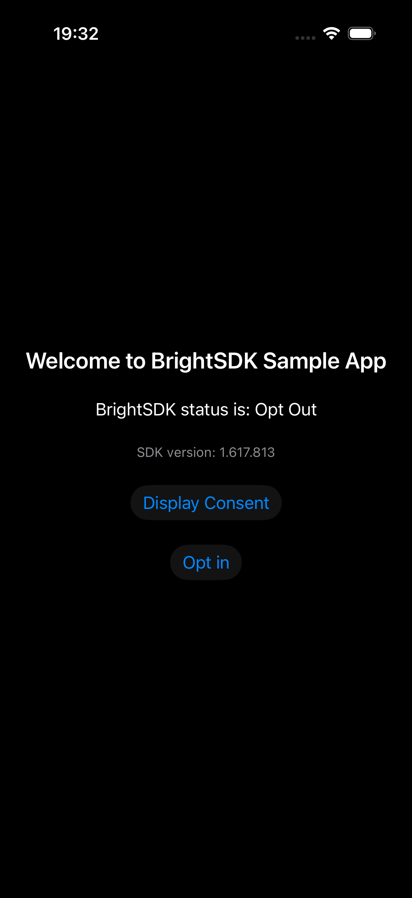
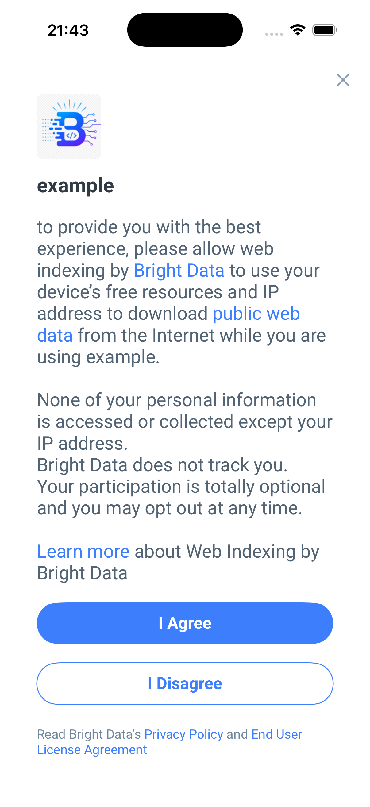
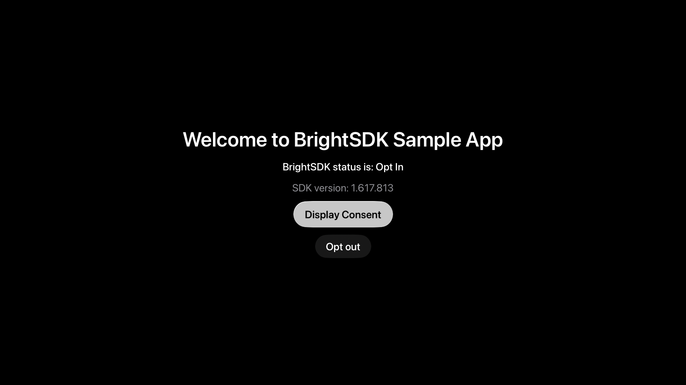
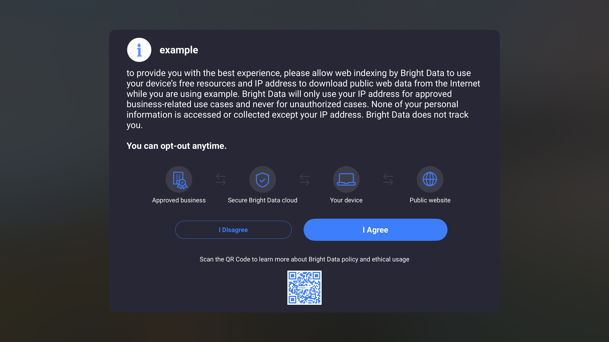
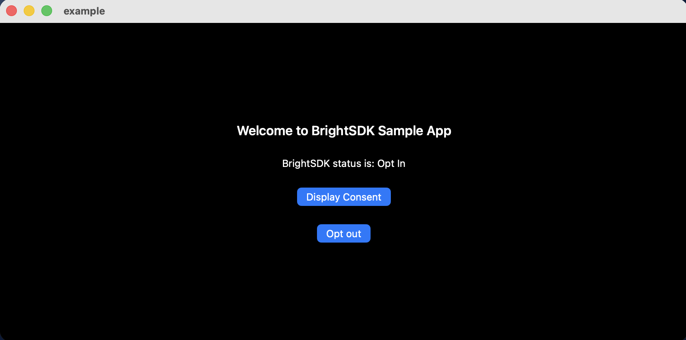
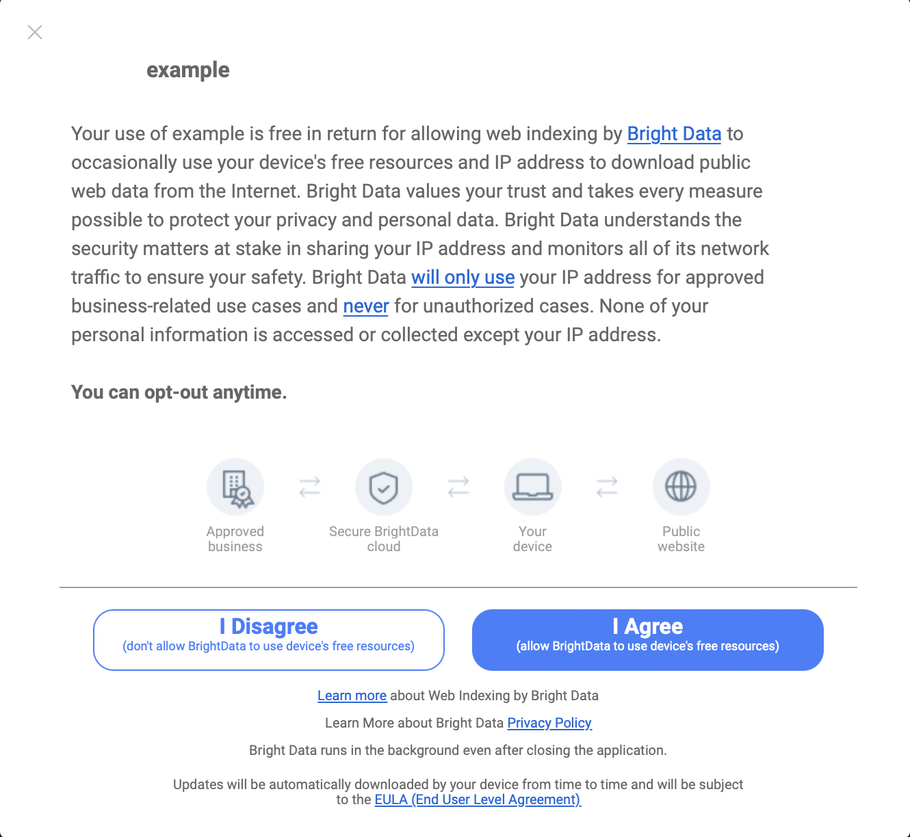

# BrightSDK — Apple Platform Integration Example

This folder demonstrates how to integrate BrightSDK into an iOS, tvOS or macOS Xcode project using the **bright-sdk-integration** CLI tool.

## Folder structure

```
apple/
├── app/                        ← shared example Xcode project (iOS + tvOS + macOS)
│   ├── example.xcodeproj/
│   └── example/                ← SwiftUI app source (ContentView.swift, exampleApp.swift)
├── ios/
│   ├── brd_sdk.config.json     ← iOS SDK config (workdir points to apple/)
│   ├── auto-update.sh          ← non-interactive update
│   ├── interactive-update.sh   ← interactive update (prompts for missing values)
│   └── reset.sh                ← remove downloaded SDK, restore clean state
├── tvos/                       ← same layout, configured for tvOS
├── macos/                      ← same layout, configured for macOS
├── BrightSDK/                  ← created at runtime (gitignored) — framework lives here
└── README.md                   ← this file
```

## Prerequisites

- **Node.js ≥ 18** — to run the integration tool
- **Xcode** — to open and build the example project
- A **BrightSDK API key** exported as `SDK_API_KEY` — see [obtain-api-key.md](https://brightsdk.github.io/bright-sdk-downloader-rs/obtain-api-key.html)
- An internet connection — the SDK zip is downloaded from the CDN on first run

## API key

The integration tool requires a **BrightSDK API key** passed via the `SDK_API_KEY` environment variable.

```sh
export SDK_API_KEY=<your-api-key>
```

**How to get a key:**

1. Log in at [bright-sdk.com](https://bright-sdk.com)
2. Go to **Settings → Company profile → API keys**
3. Copy an existing key or generate a new one

> Full step-by-step guide with screenshots:\
> <https://brightsdk.github.io/bright-sdk-downloader-rs/obtain-api-key.html>

## Quick start — example app

### 1. Install SDK and patch the Xcode project

Run the script for your target platform from its subfolder:

```sh
export SDK_API_KEY=<your-api-key>

# iOS
cd ios && sh auto-update.sh

# tvOS
cd tvos && sh auto-update.sh

# macOS
cd macos && sh auto-update.sh
```

The tool will:

1. Download the latest BrightSDK zip from `cdn.bright-sdk.com/static/`
2. Extract the framework into `apple/BrightSDK/`
3. Open `app/example.xcodeproj` and patch `project.pbxproj`:
    - Add `brdsdk.xcframework` (iOS/tvOS) or `brdsdk.framework` (macOS) with **Embed & Sign**
    - Set `FRAMEWORK_SEARCH_PATHS` (iOS/tvOS) or `LD_RUNPATH_SEARCH_PATHS` + `FRAMEWORK_SEARCH_PATHS` (macOS)
4. macOS only — also adds:
    - **Copy Files** build phase → places `net_updater.app` under `Contents/Library/LoginItems`
    - **Resign** run-script phase (when `resign_net_updater.sh` ships in the SDK zip)
    - Build settings: `NET_UPDATER_ENTITLEMENTS`, `ENABLE_USER_SCRIPT_SANDBOXING = NO`
5. Save `brd_sdk.config.json` for future runs

### 2. Open the project in Xcode

```sh
open app/example.xcodeproj
```

Or double-click `app/example.xcodeproj` in Finder.

On first open, Xcode will prompt you to select a **Development Team** for signing (no team is hardcoded).

### 3. Build and run

Select a simulator or device and press **⌘R**. The example app shows:

- A status label reflecting the current SDK consent choice
- SDK version display
- **Display Consent** — calls `brd_api.show_consent()`
- **Opt in / Opt out** — toggles SDK opt-in state

### Screenshots

#### iOS

|           Main screen            |              Consent screen               |
| :------------------------------: | :---------------------------------------: |
|  |  |

#### tvOS

|            Main screen            |               Consent screen               |
| :-------------------------------: | :----------------------------------------: |
|  |  |

#### macOS

|            Main screen             |               Consent screen                |
| :--------------------------------: | :-----------------------------------------: |
|  |  |

## Using the tool with your own project

Copy the platform subfolder (`ios/`, `tvos/`, or `macos/`) next to your own `.xcodeproj`, then edit `brd_sdk.config.json`:

```json
{
    "workdir": "..",
    "libs_dir": "BrightSDK",
    "sdk_ver": "latest"
}
```

| Key               | Description                                                                                           |
| ----------------- | ----------------------------------------------------------------------------------------------------- |
| `workdir`         | Directory that contains (or is a parent of) your `.xcodeproj`. The tool searches up to 3 levels deep. |
| `libs_dir`        | Directory where the framework will be extracted, relative to `workdir`.                               |
| `sdk_ver`         | `"latest"` or a specific version string, e.g. `"1.500.0"`.                                            |
| `sdk_service_dir` | _macOS only_ — directory for `net_updater.app`, relative to `workdir`.                                |

Then run:

```sh
# First time / interactive (prompts for any missing values):
sh interactive-update.sh

# Subsequent runs / CI:
sh auto-update.sh
```

### Pinning a version

Edit `brd_sdk.config.json` and set `sdk_ver` to the desired version:

```json
{ "sdk_ver": "1.500.0" }
```

## Integrate the SDK in Swift

```swift
// App entry point — initialise once at launch
import brdsdk

try! brd_api(
    skip_consent: false,
    app_name: "My App",
    benefit: "to provide you with the best experience"
)

// Observe consent choice changes
brd_api.onChoiceChange = { choice in
    print("consent choice:", choice.rawValue)
}

// Show the consent dialog
brd_api.show_consent(nil, benefit: "...", agree_btn: "Accept", disagree_btn: "Decline", language: "en")

// Opt out programmatically
brd_api.optOut(from: .manual)

// Read current status
let choice = brd_api.currentChoice   // BrdChoice enum
let version = brd_api.sdkVersion
let uuid = brd_api.get_uuid()
```

## Known Issues

### macOS — Xcode version compatibility

The macOS `brdsdk.framework` is built with **Xcode 26.4** (Swift 6.3.0). Building with a
different Xcode version may produce compiler errors. Use Xcode 26 for macOS builds:

```sh
sudo xcode-select -s /Applications/Xcode.app/Contents/Developer
```

### macOS — Code signing with net_updater.app

When building for macOS without a provisioning profile, Xcode may report:

```
error: Embedded binary is not signed with the same certificate as the parent app.
```

Pass `CODE_SIGNING_ALLOWED=NO` for local development builds:

```sh
xcodebuild -scheme example -destination 'platform=macOS' CODE_SIGNING_ALLOWED=NO build
```

## Reset / clean up

```sh
# From any platform subfolder:
sh reset.sh
```

Removes `apple/BrightSDK/` (downloaded frameworks) and restores `app/` to its committed state via `git checkout`.
